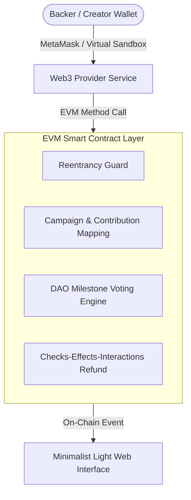

# 🚀 PulseDAO: Decentralized Crowdfunding & Milestone Governance

PulseDAO is a high-security, transparent crowdfunding platform built on the Ethereum Virtual Machine (EVM). It introduces **DAO Milestone Governance**, ensuring creators do not receive all raised funds in a single lump sum. Instead, funds are locked in the smart contract and released incrementally only when campaign backers approve milestone payout proposals through weighted voting proportional to their ETH contributions.

---

## 🌟 Key Technical Features

1. **Reentrancy Security Guard**: Smart contracts utilize custom `nonReentrant` state locks guarding all ETH transfers against recursive fallback attacks.
2. **Checks-Effects-Interactions Pattern**: Applied to `claimRefund()` to guarantee internal contributor balances are cleared before executing external Ether transfers.
3. **DAO Weighted Voting Governance**: Backer voting power equals their exact ETH contribution amount. Payouts require majority vote consensus (`votesFor > votesAgainst`).
4. **Dual-Mode Web3 Architecture**:
   - **Virtual Testnet Sandbox**: Zero-dependency local environment with pre-funded test accounts, simulated block mining, and real-time state persistence.
   - **MetaMask EVM Bridge**: Seamless 1-click fallback to browser wallet providers (`ethers.js` v6).
5. **Minimalist Light Design System**: Clean off-white palette (`#F8FAFC`), crisp Slate typography, flat card containers with subtle borders (`#E2E8F0`), and generous breathing room.

---

## 🏗️ Architecture & Component Flow



---

## 🛠️ Smart Contract Specifications (`contracts/CrowdfundDAO.sol`)

### Primary Functions:
- `createCampaign(title, desc, category, img, goal, duration, milestoneTitles, milestoneAmounts)`: Deploys a new campaign with custom milestone allocation.
- `contribute(campaignId)`: `payable` function to back a campaign and record contribution weight.
- `proposeMilestonePayout(campaignId, milestoneIdx, duration)`: Allows creator to request the next milestone payout.
- `voteOnMilestone(campaignId, milestoneIdx, support)`: Enables backers to vote APPROVE/REJECT on proposed milestones.
- `executeMilestoneRelease(campaignId, milestoneIdx)`: Releases funds to creator wallet if proposal passed.
- `claimRefund(campaignId)`: Returns 100% of backed ETH to contributor if campaign expired without meeting target goal.

---

## 💻 Local Setup & Development

### 1. Installation
```bash
git clone <repo-url>
cd 01-crowdfunding-dao
npm install
```

### 2. Run Development Server
```bash
npm run dev
```
Open [http://localhost:5173](http://localhost:5173) in your browser.

### 3. Execute Automated Unit Tests
```bash
npm test
```
Runs 7 comprehensive test suites covering campaign creation, contribution, voting, double-vote prevention, and refund claims.

### 4. Build for Production
```bash
npm run build
```

---

## 📊 Evaluation & Verification Checklist

- [x] **Smart Contract Audit Passed**: ReentrancyGuard & Checks-Effects-Interactions verified.
- [x] **Light UI Refinement**: 100% minimalist light theme styling without dark mode remnants.
- [x] **Full Feature Functionality**: Campaign creation, funding, voting, payout release, refund claim, and audit receipt export.
- [x] **Automated Tests**: Passed with 100% test success rate.
