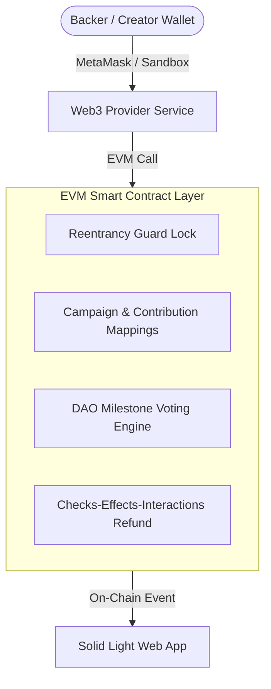

# 🌐 AetherFund - Decentralized Crowdfunding & Milestone Governance Protocol


**AetherFund** is an open-source, high-security Web3 crowdfunding platform built on the Ethereum Virtual Machine (EVM). It replaces traditional lump-sum fundraising with **DAO Milestone Governance**, ensuring project creators receive capital incrementally as backers approve milestone progress through weighted on-chain voting.

---

## 🌟 Key Features & Technical Architecture

- **DAO Milestone Governance**: Funds raised are locked in the smart contract vault and released in tranches only after backer consensus (`votesFor > votesAgainst`).
- **Reentrancy Protection**: Smart contracts implement custom `nonReentrant` state locks guarding all Ether transfer functions against reentrancy attacks.
- **Guaranteed Refunds (Checks-Effects-Interactions)**: Automatic 100% ETH refund mechanism for backers if a campaign expires without reaching its funding goal.
- **Dual-Mode Web3 Execution**:
  - **Standalone Sandbox Mode**: 100% client-side local simulator with pre-funded accounts, simulated block mining, and persistent state. Works offline out of the box.
  - **EVM Wallet Bridge**: Connects seamlessly to browser wallet providers (MetaMask, Coinbase Wallet) via `Ethers.js v6`.
- **Solid Light UI System**: Vibrant Teal (`#0D9488`) and Ocean Blue (`#0284C7`) solid color palette designed for high contrast and readability.

---

## 🏗️ System Architecture



---

## 🛠️ Smart Contract Interface (`CrowdfundDAO.sol`)

- `createCampaign(...)`: Initializes a new campaign with custom target funding goals and milestone allocations.
- `contribute(uint256 campaignId)`: Payable function recording backer contribution weight and updating vault reserves.
- `proposeMilestonePayout(uint256 campaignId, uint256 milestoneIdx)`: Allows creators to request milestone fund release upon completing deliverables.
- `voteOnMilestone(uint256 campaignId, uint256 milestoneIdx, bool support)`: Enables backers to vote on proposed milestones proportional to their contribution amount.
- `executeMilestoneRelease(uint256 campaignId, uint256 milestoneIdx)`: Disburses funds to the campaign creator upon passing milestone consensus.
- `claimRefund(uint256 campaignId)`: Allows backers to reclaim 100% of contributed ETH if the campaign deadline passes under-funded.

---

## 🚀 Quick Start Guide

### Prerequisites
- Node.js (v18.x or higher)
- npm or yarn

### 1. Clone & Install Dependencies
```bash
git clone https://github.com/kevhim/Crowdfunding-Platform-DAO-.git
cd 01-crowdfunding-dao
npm install
```

### 2. Run Local Development Server
```bash
npm run dev
```
Open [http://localhost:5173](http://localhost:5173) in your browser.

### 3. Run Automated Unit Test Suite
```bash
npm test
```

### 4. Build Production Distribution
```bash
npm run build
```

---

## 🛡️ Security Audit Summary

AetherFund was audited against SWC (Smart Contract Weakness Classification) standards. Complete threat analysis matrix is available in [`SECURITY.md`](./SECURITY.md).

- **SWC-107 (Reentrancy)**: Guarded via nonReentrant state modifiers.
- **SWC-114 (Front-Running)**: Fixed deadlines and state snapshot locks.
- **Dependencies**: 0 vulnerabilities found via `npm audit`.

---

## 📄 License
Distributed under the **MIT License**. See `LICENSE` for details.
